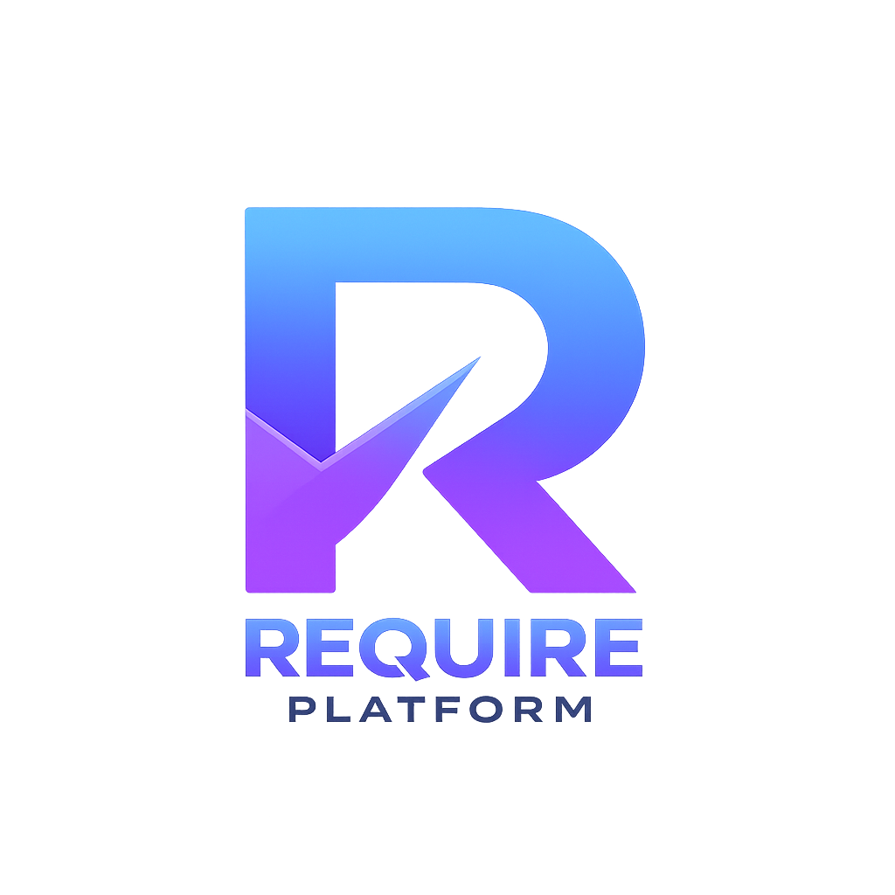

<p align="center">
  
</p>

<h1 align="center">RequierUI</h1>

<p align="center">
  Demonstration user interface for Requier EDR
</p>

<p align="center">
  
  
  
  
  
</p>

---

**RequierUI** is a public demonstration version of the graphical interface for **Requier EDR**, developed as part of **Requier Platform**.

This repository is intended solely for reviewing the user interface, window architecture, and visual style of the project.

---

## About

Requier EDR is a behavioral endpoint detection and response system focused on monitoring, analysis, and protection of endpoint devices.

This repository **is not the full product** and contains only the user interface.

All internal platform components responsible for threat detection, analysis, and response are not included.

---

## What's Included

-   Requier EDR Graphical Interface
-   WPF Window Markup
-   Custom User Controls
-   Design Themes
-   Icons and Visual Resources
-   Demo Application Structure

---

## Features

### Dashboard

-   Protection protocol selector (Safe / Auto / Mania / Slayer)
-   Emergency LockDown
-   Protection status monitoring

### Scanning

-   Deep scan interface
-   Progress display
-   Operation log

### Threat Research

-   Drag & Drop binary files
-   Object analysis interface
-   Reverse engineering preparation

### Process Manager

-   Process overview
-   Kill, suspend, and resume processes
-   Memory dump creation

### System Monitor

-   Network connections
-   Port analysis interface
-   System activity monitor

### Additional Sections

-   YARA Scanner
-   Quarantine
-   Event Timeline
-   Memory Forensics
-   Registry Shield
-   Integrity Monitor
-   USB Monitor
-   Anti-Scam Guardian
-   System Recovery

---

## Technologies

-   .NET 7.0
-   WPF
-   XAML
-   C# C++ C
-   Fully custom user interface
-   Dark theme
-   Consolas font

---

## Project Structure

```
RequierUI/
├── App.xaml
├── App.xaml.cs
├── MainWindow.xaml
├── MainWindow.xaml.cs
├── RequierUI.csproj
├── WARNING.md
└── .gitignore
```

---

## Build

dotnet build -c Release

Executable:

```
bin/Release/net7.0-windows/RequierUI.exe
```

---

## Limitations

This repository contains **the user interface only**.

The following components are **not included**:

-   Detection engines
-   Behavioral analysis
-   Internal services
-   Response protocols
-   Driver components
-   Self-defense mechanisms
-   Network components
-   Internal APIs
-   Other proprietary Requier Platform technologies

Some interface elements may be unavailable or run in demo mode.

---

## License

The interface source code is distributed for informational purposes only.

All Requier Platform technologies related to threat detection, behavioral analysis, and response are proprietary and not distributed as part of this repository.

---

<p align="center">
  <b>Requier Platform</b><br>
  <i>Security should be required. 🛡️</i>
</p>
